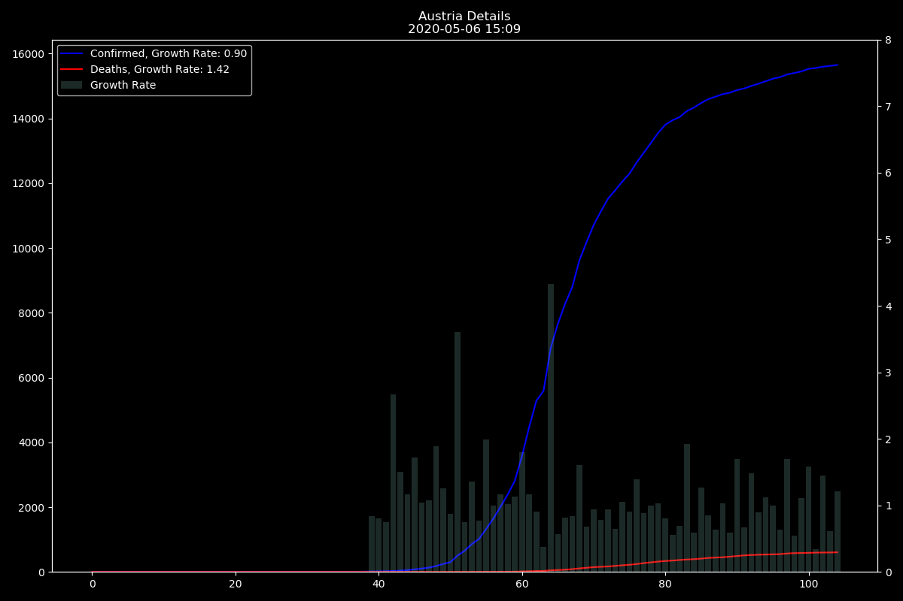
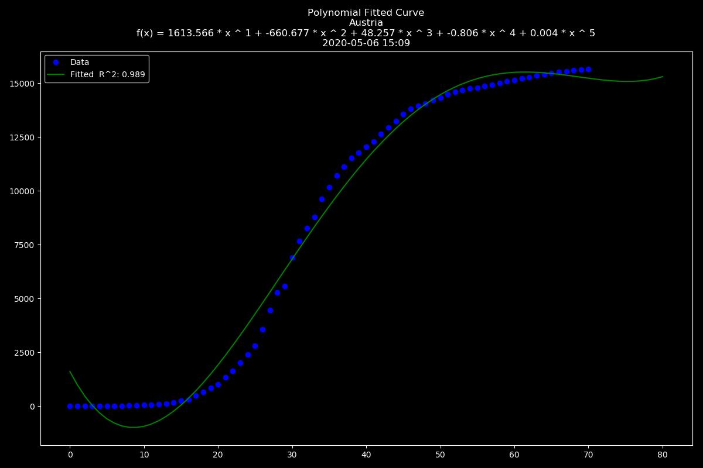

A Simple Dashboard for COVID-19 Data
====================================

Displays some Data from the John Hopkins Data set.

Relys on this Repository: https://github.com/CSSEGISandData/COVID-19

Charts
======

Country Details
---------------

Growth Rate is Calculated like this

Groth Rate in the Legend is the Average Groth Rate of the last 4 Days.

Comparison
----------

Comparison of Countries/Regions with zero padded Data.

Polynomial Fit
--------------

Polynomial fitted Data.

