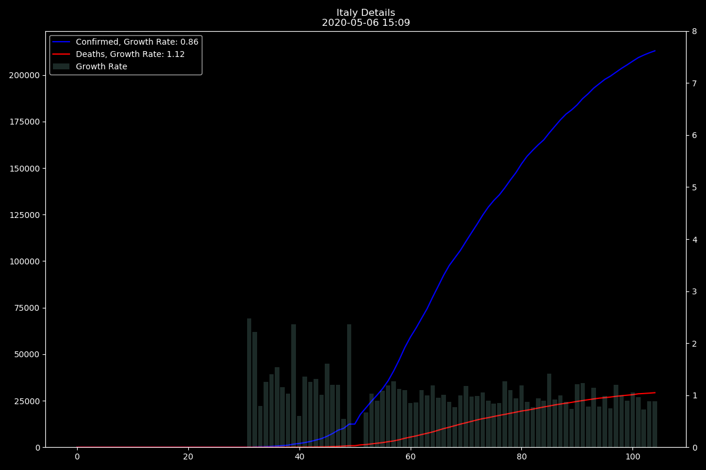
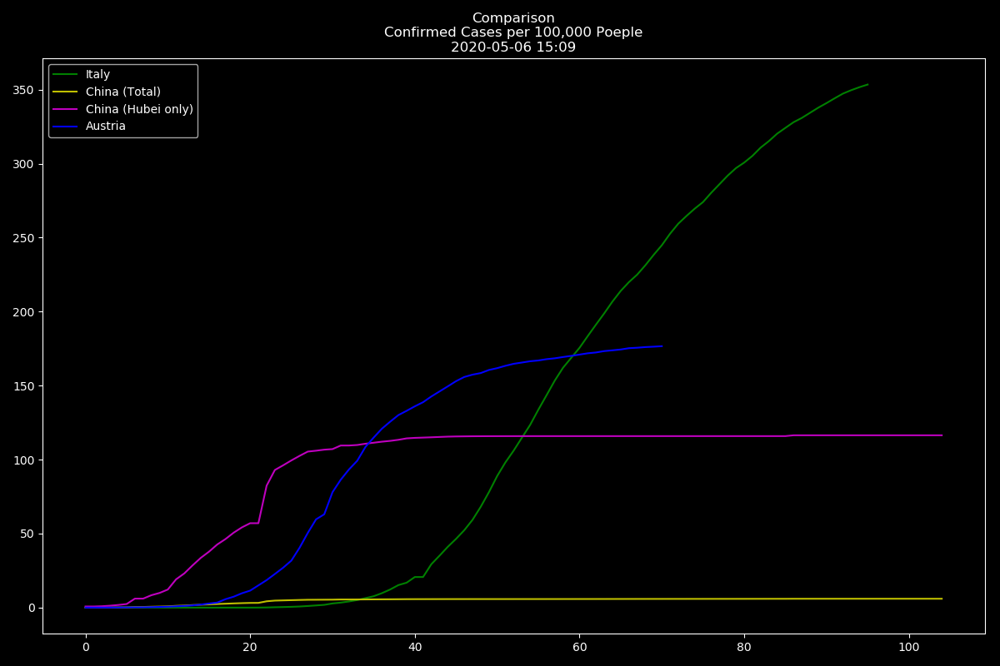

COVID-19 Charts based on the John Hopkins Data Set
==================================================

Displays some Data from the John Hopkins Data set.

Relys on this Repository: https://github.com/CSSEGISandData/COVID-19

Charts
======

Country Details
---------------

Growth Rate is Calculated like this

Growth Rate displayed in the Legend is the Average Growth Rate of the last 4 Days.

Comparison
----------

Comparison of Countries/Regions with zero padded Data.

Polynomial Fit
--------------

